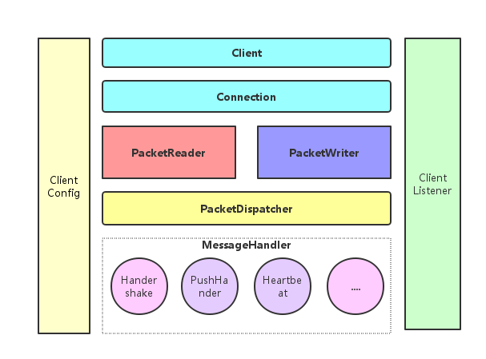

# MpushClient架构设计

## 架构图 

## 说明
1. `MpushClient`主要是为Android客户端设计，作为Android底层通信组件

2. `MpushClient`实现了所有Mpush的协议，也包加密，压缩等特性

3. `MpushClient`对SDK只暴露了3个对象：`Client、ClientConfig、ClientListener`

4. `ClientConfig`提供了所有支持对配置设置项，所有的配置都必须使用此对象设置

5. `Client`主要暴露一些往服务端上行的方法，常用的有：

   ```java
   public interface MPushProtocol {

       boolean healthCheck();//健康检查，读写超时检查，发送心跳

       void fastConnect();//快速重连

       void handshake();//握手交互密钥

       void bindUser(String userId);//绑定用户到链接

       void unbindUser();//解绑

       Future<HttpResponse> sendHttp(HttpRequest request);//发送HTTP代理亲求
   }
   ```

   ​

6. 所有服务端下行的消息都直接转交给`ClientListener`来处理:

   ```java
   public interface ClientListener {

       void onConnected(Client client);

       void onDisConnected(Client client);

       void onHandshakeOk(Client client, int heartbeat);

       void onReceivePush(Client client, byte[] content);

       void onKickUser(String deviceId, String userId);
   }
   ```

   ​

7. 定时发送心跳部分的定时功能，`MpushClient`没有去实现，因为Android有比`Timer`更好的实现`AlarmManager`, 所以定时功能由SDK收到`onHandshakeOk`事件时去触发。

8. 内部组件主要有:`Connection、PacketReader、PacketWriter、PacketDispatcher、MessageHandler、ExecutorManager、AllotClient` 等

9. `Connection`负责TCP链接创建、维护、关闭、重连及校验读写超时时间等

10. `AllotClient`负责从`AllotServer`获取最新的MpushServer IP地址列表

11. `PacketReader` 负责数据包的解码及沾包、半包的处理，独占一个线程负责消息的读取。

12. `PacketWriter`负责数据发送数据内部维护一个只有一个线程的线程池，如果发送失败，会尝试重发直到超时。

13. `PacketReader、PacketWriter`内部还分别维护了一个`ByteBuf`使用的是堆外内存(`allocateDirect`)该buffer只分配一次后续一直重复使用，__避免反复的分配内存和垃圾回收__，这点对于客户端还是非常有意义的。

14. `PacketDispatcher`负责根据`Packet`的`Command`把包分发到相应的`MessageHander`。

15. `MessageHandler`主要负责把`Packet`反序列化为业务`Message`包括解码和解压，并处理相应的业务逻辑，比如触发下一步的请求，或通知`Listener`。

16. `ExecutorManager`负责整个客户端的线程、线程池的分配和销毁。
